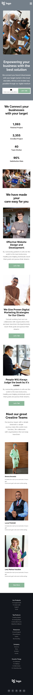

# Business Landing Page &nbsp;  &nbsp; 

## Skills acquired 👨‍💻
- Learned about the object fit and object position property.
- How to design te footer using flexbox properties.
- How to use the flex property to to align the items.

## Time taken to complete the project ⏲️

14hrs

## Screenshot &nbsp; 

 
 

 
 
